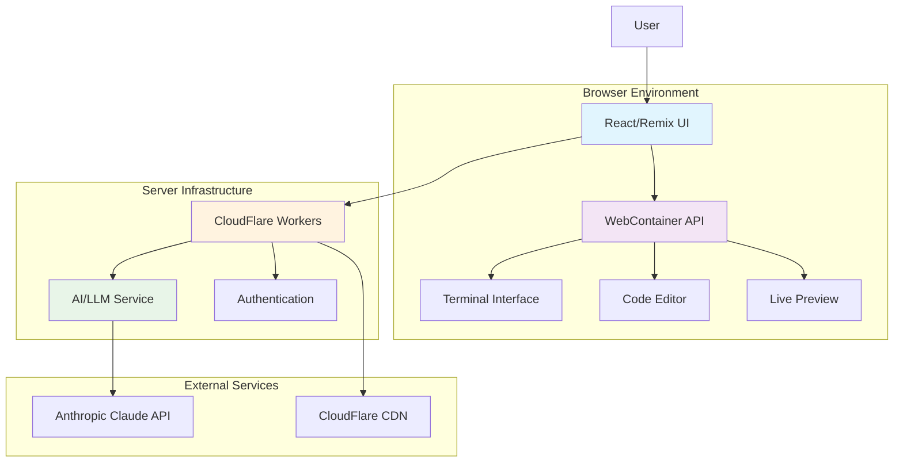
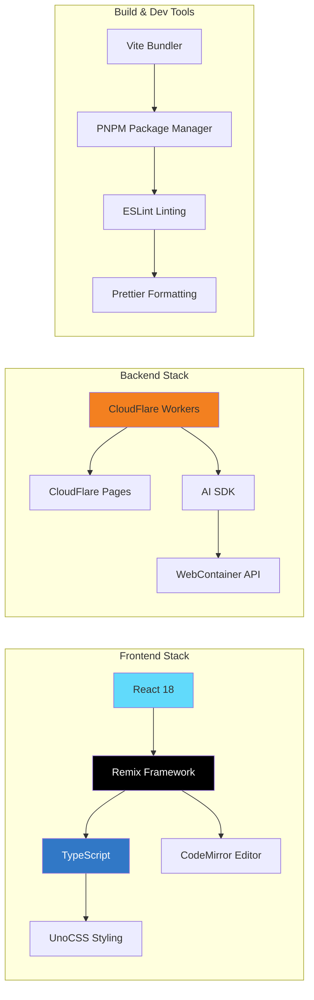
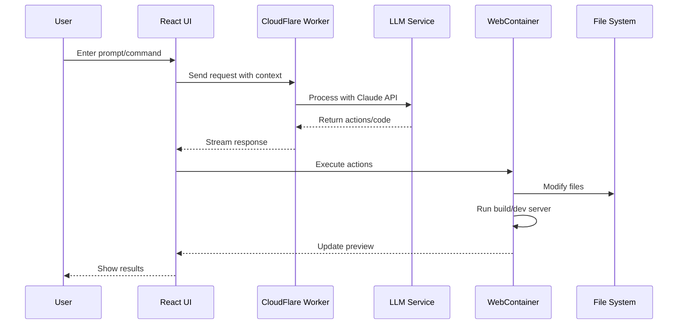
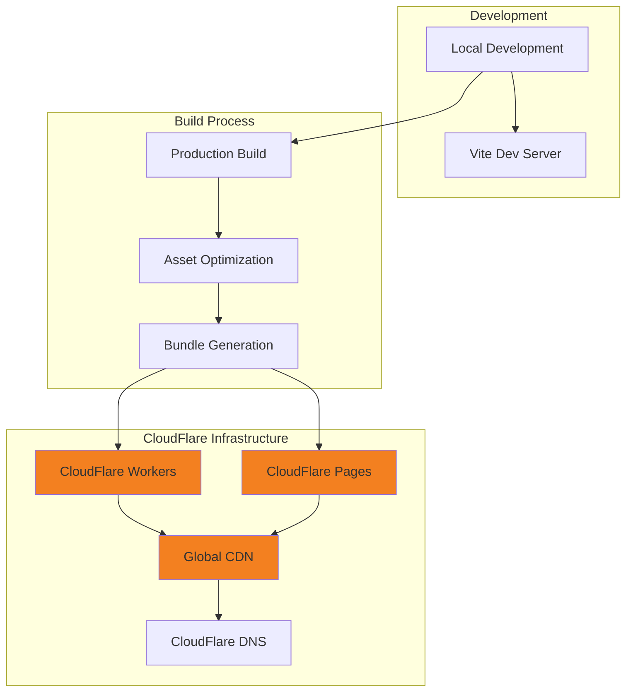

# OpenBolt Architecture Overview

OpenBolt is an AI-powered full-stack web development platform that enables users to prompt, run, edit, and deploy applications directly in the browser. This document provides a comprehensive overview of the system architecture.

## System Overview

OpenBolt combines cutting-edge AI models with a browser-based development environment powered by StackBlitz's WebContainers API, creating a unique development experience where AI has complete control over the entire development lifecycle.

## Core Design Principles

### 1. **Browser-First Development**
- Complete development environment runs in the browser
- No local setup or installations required
- Real-time collaboration and sharing capabilities

### 2. **AI-Driven Development**
- AI has full control over filesystem, terminal, and package manager
- Intelligent code generation and modification
- Context-aware assistance throughout the development lifecycle

### 3. **Full-Stack Capability**
- Support for Node.js servers and backend development
- Integration with third-party APIs
- Complete application deployment from chat interface

### 4. **Serverless Architecture**
- CloudFlare Workers for scalable server-side logic
- Edge-based deployment for global performance
- Stateless design for reliability and scalability

## Technology Stack

## Key Components

### Frontend Layer
- **React/Remix Application**: Main user interface and application framework
- **Code Editor**: Advanced code editing with syntax highlighting and autocompletion
- **Terminal Interface**: Browser-based terminal for development operations
- **Live Preview**: Real-time preview of running applications
- **Chat Interface**: AI interaction and prompt handling

### Development Environment
- **WebContainer API**: Browser-based Node.js runtime environment
- **File System**: Virtual file system for project management
- **Package Manager**: NPM/PNPM integration for dependency management
- **Development Server**: Hot-reload enabled development server

### AI Integration Layer
- **LLM Service**: Integration with Anthropic Claude AI models
- **Prompt Processing**: Natural language to code conversion
- **Context Management**: Maintains conversation and project context
- **Action Runner**: Executes AI-generated development actions

### Infrastructure Layer
- **CloudFlare Workers**: Serverless compute for backend logic
- **CloudFlare Pages**: Static site hosting and deployment
- **Edge CDN**: Global content delivery network
- **Authentication**: User authentication and session management

## Data Flow Architecture

The system follows a clear data flow pattern from user interaction to AI processing and back to the development environment:

## Security Model

- **Sandboxed Execution**: All code runs in isolated WebContainer environments
- **No Server Access**: Generated code cannot access production servers
- **Client-Side Security**: Sensitive operations handled client-side
- **API Key Management**: Secure handling of external API credentials

## Performance Characteristics

- **Edge Computing**: CloudFlare's global edge network for low latency
- **Client-Side Processing**: Reduces server load and improves responsiveness
- **Streaming Responses**: Real-time AI response streaming
- **Efficient Bundling**: Vite-based fast build and hot reload

## Deployment Model

This architecture enables OpenBolt to provide a powerful, scalable, and secure development environment that brings AI-assisted development directly to the browser while maintaining production-grade performance and reliability.