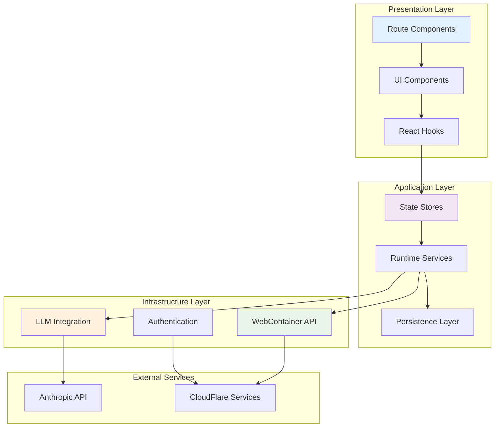
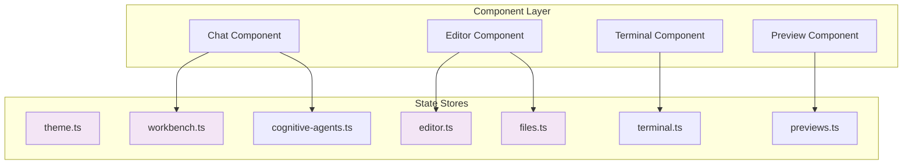
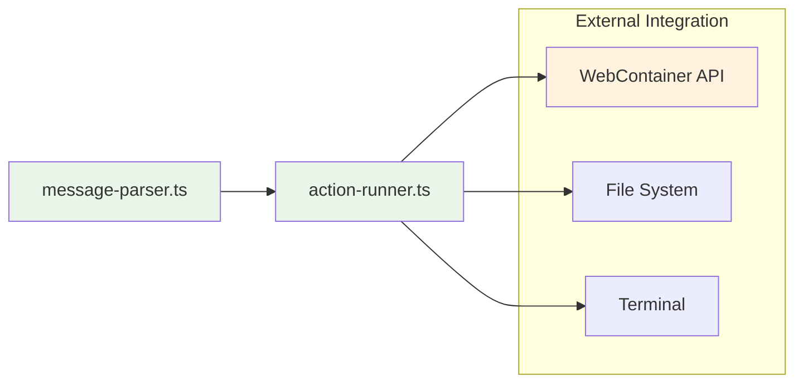
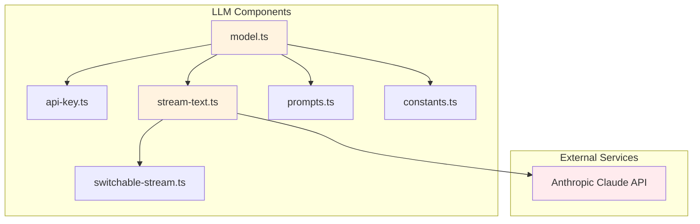
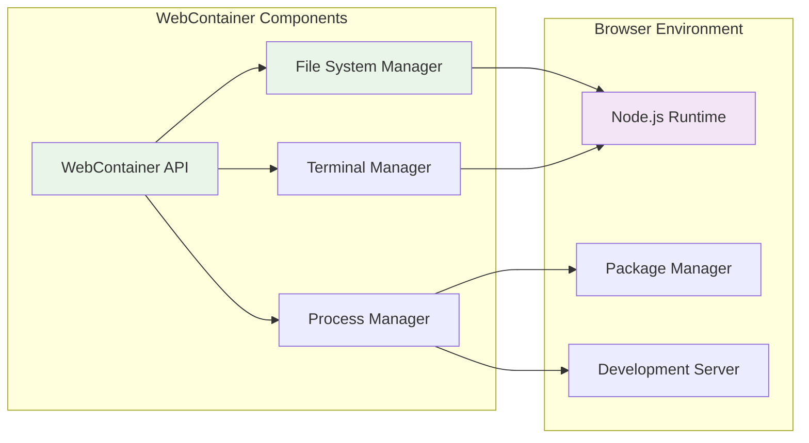
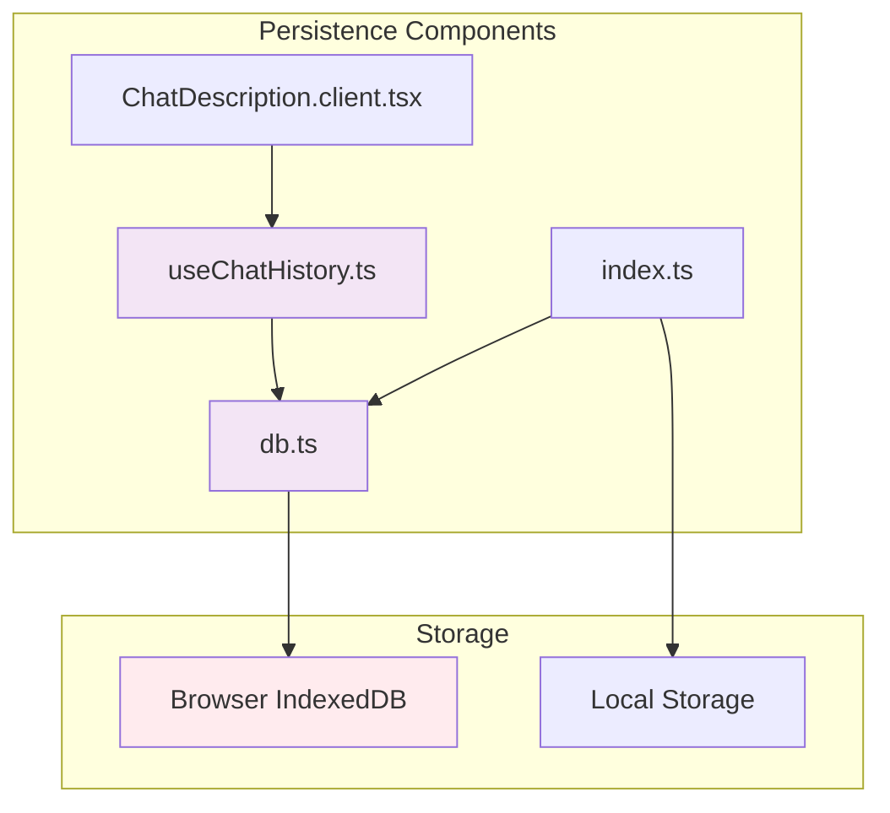
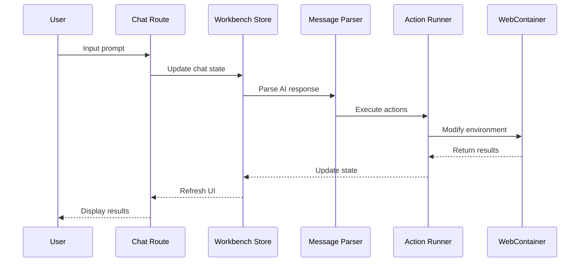
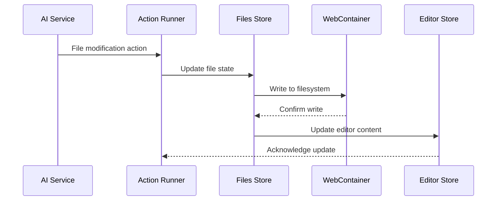
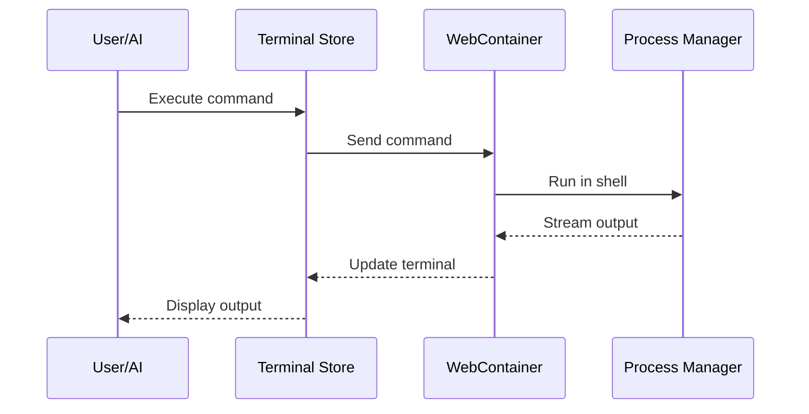
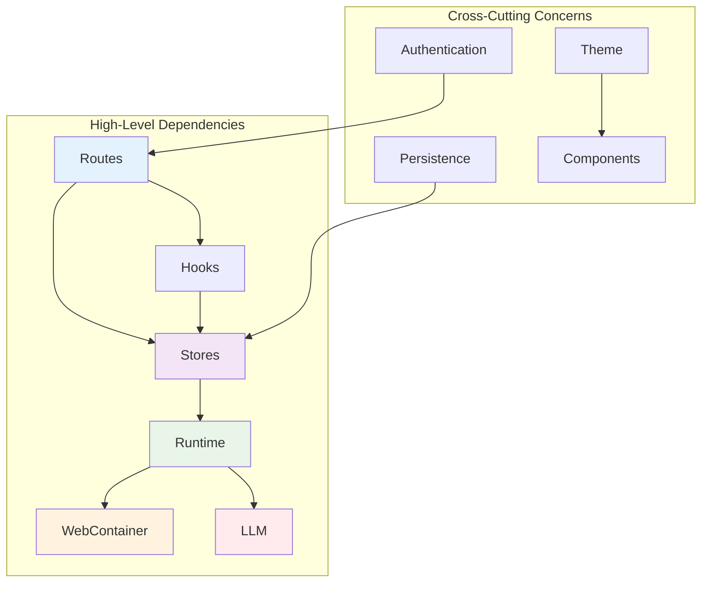

# Component Architecture

This document details the component structure and relationships within the OpenBolt application, providing insight into how different parts of the system interact and depend on each other.

## Component Overview

OpenBolt follows a modular architecture with clear separation of concerns across different layers:



## Directory Structure

```
app/
├── routes/                 # Route components and API endpoints
│   ├── _index.tsx         # Landing page
│   ├── chat.$id.tsx       # Chat interface
│   ├── api.chat.ts        # Chat API endpoint
│   ├── api.enhancer.ts    # Prompt enhancement API
│   └── api.cognitive-agents.ts # Cognitive agents API
├── components/            # Reusable UI components
├── lib/                   # Core application logic
│   ├── .server/          # Server-side only code
│   │   └── llm/          # LLM integration
│   ├── stores/           # State management
│   ├── hooks/            # React hooks
│   ├── runtime/          # Runtime services
│   ├── persistence/      # Data persistence
│   ├── webcontainer/     # WebContainer integration
│   └── cognitive/        # Cognitive agents
├── styles/               # Global styles
├── types/                # TypeScript type definitions
└── utils/                # Utility functions
```

## Core Component Modules

### 1. Route Components (`/routes`)

```mermaid
graph LR
    Index[/_index.tsx]
    Chat[/chat.$id.tsx]
    ChatAPI[/api.chat.ts]
    EnhancerAPI[/api.enhancer.ts]
    CognitiveAPI[/api.cognitive-agents.ts]
    
    Index --> Chat
    Chat --> ChatAPI
    Chat --> EnhancerAPI
    Chat --> CognitiveAPI
    
    style Index fill:#e1f5fe
    style Chat fill:#e1f5fe
    style ChatAPI fill:#fff3e0
    style EnhancerAPI fill:#fff3e0
    style CognitiveAPI fill:#fff3e0
```

**Key Responsibilities:**
- **_index.tsx**: Landing page and application entry point
- **chat.$id.tsx**: Main chat interface with AI interaction
- **api.chat.ts**: Handles chat messages and AI responses
- **api.enhancer.ts**: Prompt enhancement and optimization
- **api.cognitive-agents.ts**: Cognitive agent management

### 2. State Management (`/lib/stores`)



**Store Responsibilities:**
- **theme.ts**: Theme and UI preferences management
- **editor.ts**: Code editor state and configuration
- **files.ts**: File system state and operations
- **terminal.ts**: Terminal session and command history
- **workbench.ts**: Overall workbench state coordination
- **previews.ts**: Application preview management
- **cognitive-agents.ts**: AI agent state and interactions

### 3. Runtime Services (`/lib/runtime`)



**Service Responsibilities:**
- **message-parser.ts**: Parses AI responses and extracts actions
- **action-runner.ts**: Executes parsed actions in the development environment

### 4. LLM Integration (`/lib/.server/llm`)



**LLM Component Responsibilities:**
- **model.ts**: AI model configuration and initialization
- **api-key.ts**: API key management and validation
- **stream-text.ts**: Streaming text responses from AI
- **switchable-stream.ts**: Stream switching and management
- **prompts.ts**: System prompts and prompt templates
- **constants.ts**: LLM-related constants and configuration

### 5. WebContainer Integration (`/lib/webcontainer`)



**WebContainer Responsibilities:**
- Browser-based Node.js runtime environment
- Virtual file system management
- Terminal and shell access
- Package installation and management
- Development server hosting

### 6. Persistence Layer (`/lib/persistence`)



**Persistence Responsibilities:**
- **db.ts**: Database abstraction and operations
- **useChatHistory.ts**: Chat history management hook
- **ChatDescription.client.tsx**: Chat metadata management
- **index.ts**: Persistence layer exports and utilities

## Component Interaction Patterns

### 1. User Interaction Flow



### 2. File Operations Flow



### 3. Terminal Command Flow



## Component Dependencies



This component architecture ensures:
- **Clear separation of concerns** between presentation, application, and infrastructure layers
- **Unidirectional data flow** for predictable state management
- **Modular design** enabling easy testing and maintenance
- **Scalable structure** supporting future feature additions