# Data Flow Architecture

This document describes how data flows through the OpenBolt system, from user interactions to AI processing and back to the development environment.

## Overview

OpenBolt's data flow follows a reactive, event-driven architecture where user actions trigger cascading updates throughout the system. The flow is designed to be:

- **Unidirectional**: Data flows in predictable patterns
- **Reactive**: Changes propagate automatically through the system  
- **Streaming**: Real-time updates for AI responses and development feedback
- **Persistent**: Critical state is preserved across sessions

## High-Level Data Flow

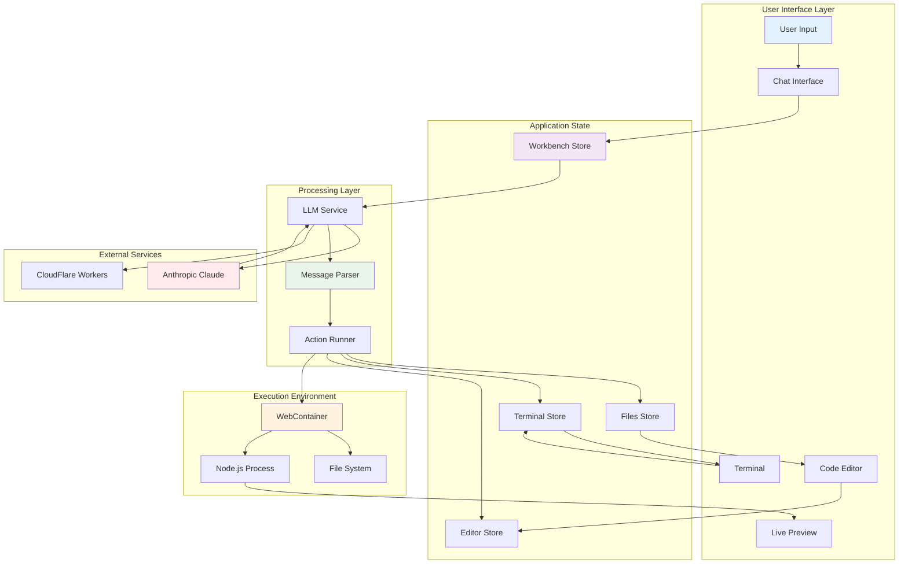

## Detailed Data Flow Patterns

### 1. Chat Interaction Flow

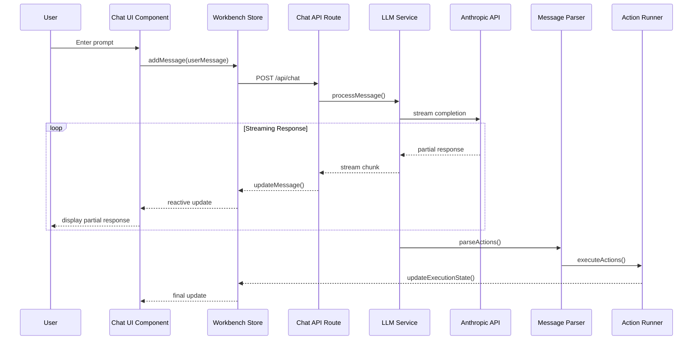

### 2. File Operations Data Flow

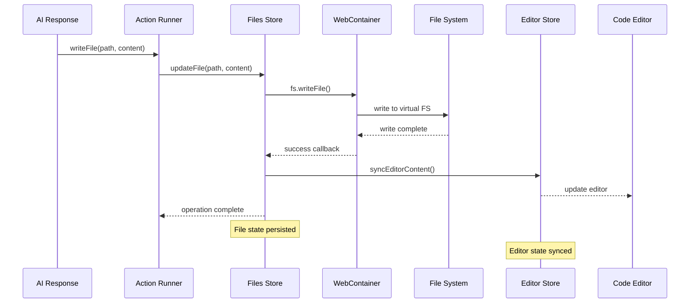

### 3. Terminal Command Execution Flow

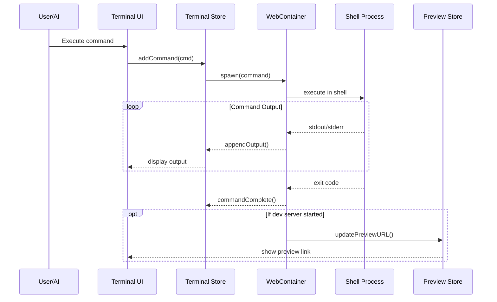

### 4. Code Editor Synchronization Flow

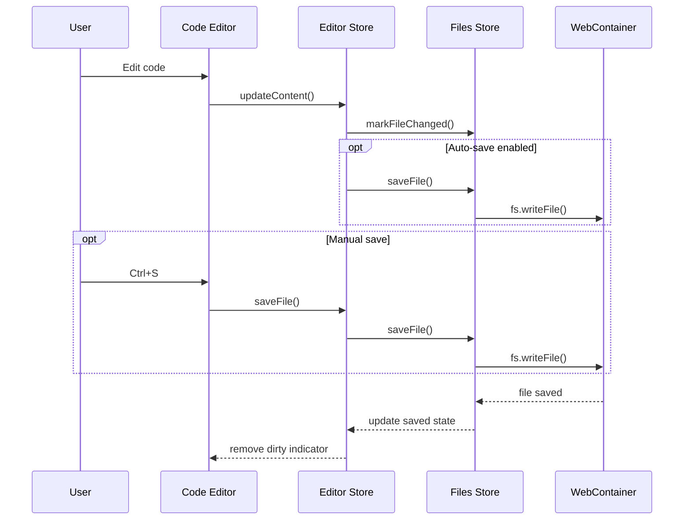

## State Management Architecture

### Store Dependencies and Data Flow

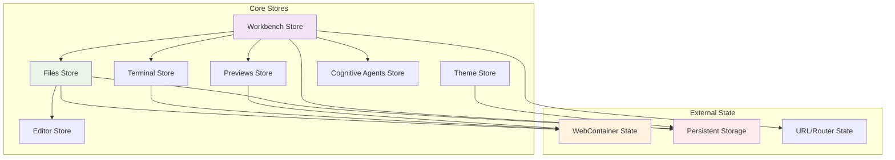

### Store Update Patterns

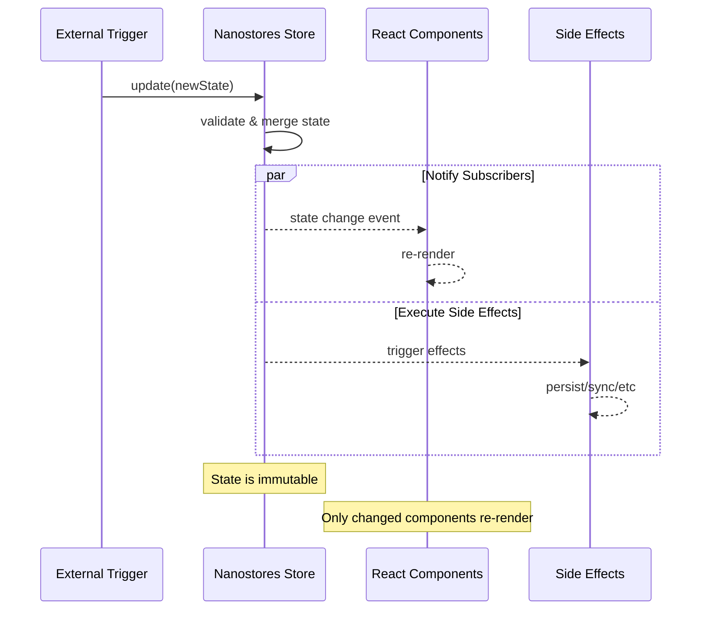

## Data Persistence Strategy

### Client-Side Storage

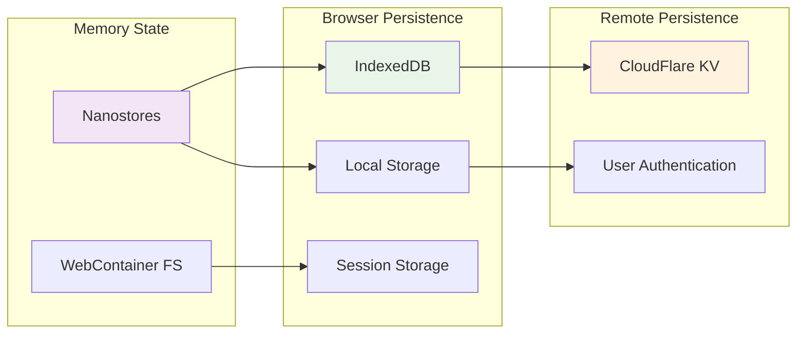

### Persistence Timing

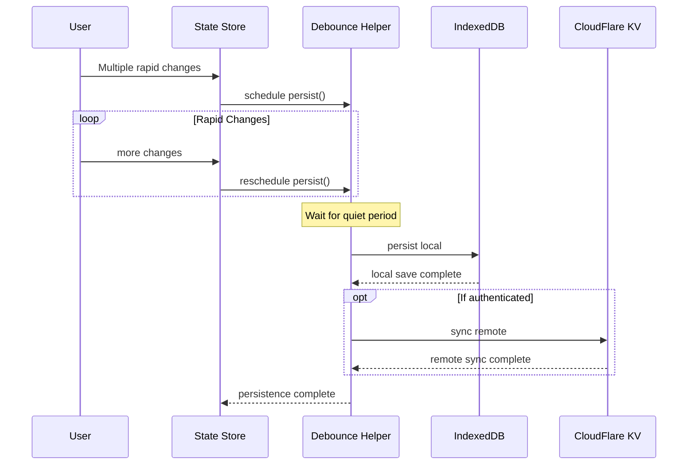

## Real-Time Data Streaming

### AI Response Streaming

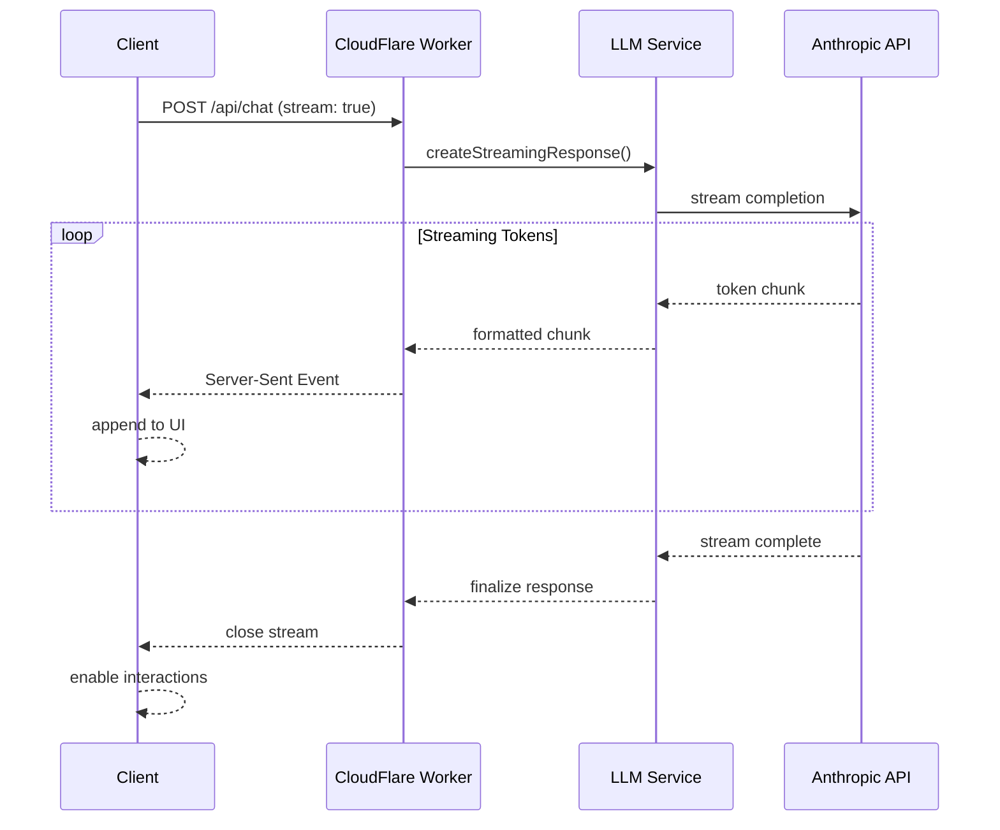

### WebContainer Event Streaming

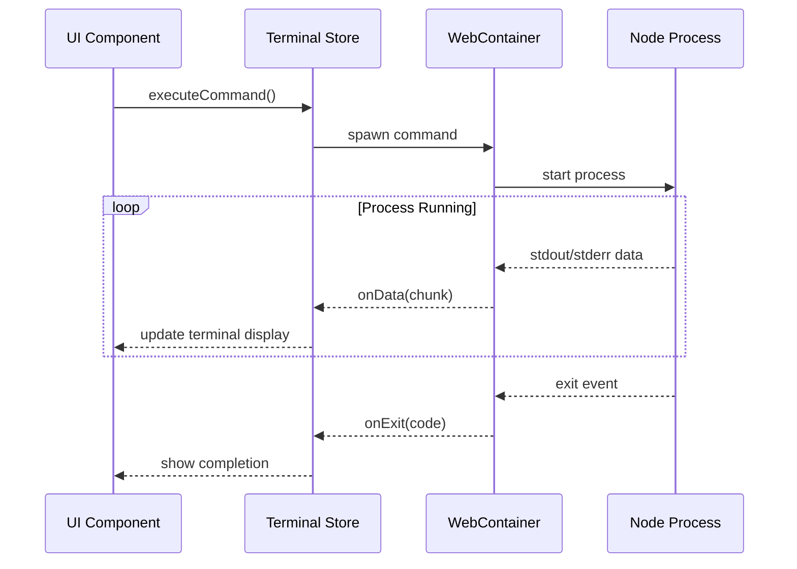

## Error Handling and Recovery

### Error Propagation Flow

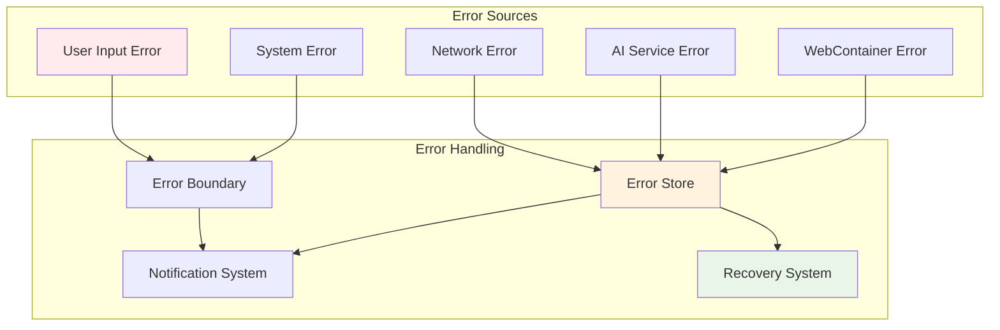

This data flow architecture ensures:
- **Predictable state updates** through unidirectional flow
- **Real-time responsiveness** via streaming and reactive patterns
- **Robust error handling** with graceful degradation
- **Efficient persistence** with intelligent caching and syncing
- **Scalable architecture** supporting complex interactions