# Deployment Architecture

This document outlines the deployment strategy, infrastructure, and operational aspects of the OpenBolt platform.

## Deployment Overview

OpenBolt is designed as a serverless-first application leveraging CloudFlare's edge computing platform for global performance and scalability.

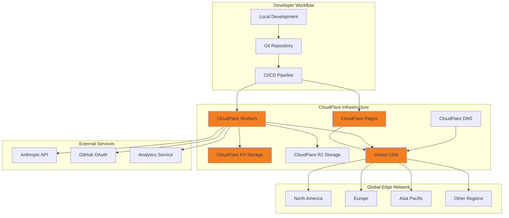

## Infrastructure Components

### 1. CloudFlare Workers (Server-Side Logic)

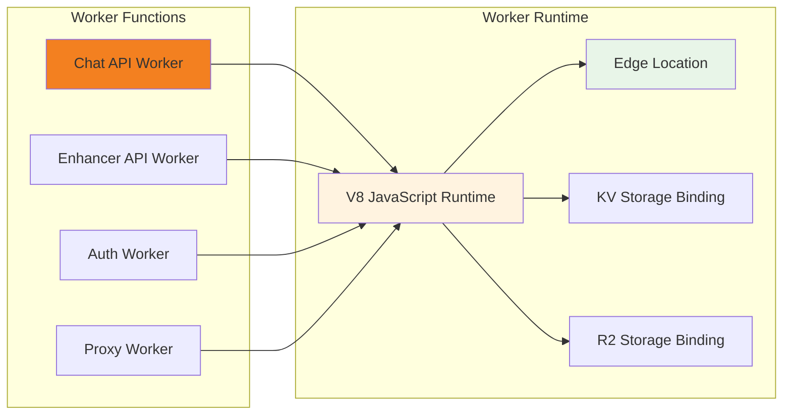

**Worker Responsibilities:**
- **Chat API Worker**: Handles AI chat interactions and streaming responses
- **Enhancer API Worker**: Processes prompt enhancement requests
- **Auth Worker**: Manages user authentication and session handling
- **Proxy Worker**: Handles external API proxying and rate limiting

### 2. CloudFlare Pages (Static Assets)

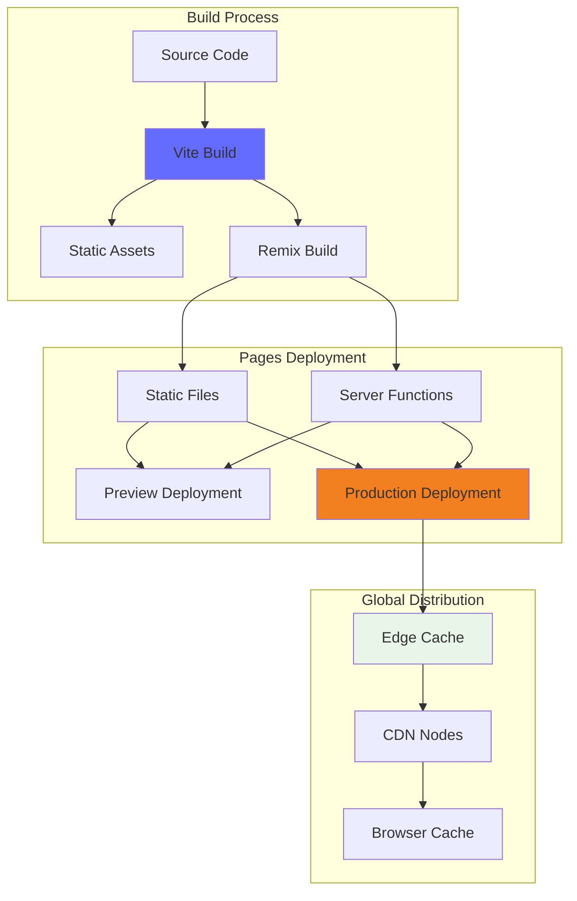

### 3. Storage Architecture

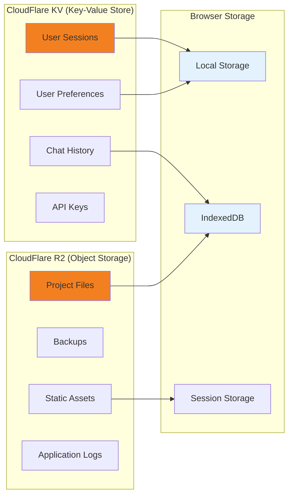

## Deployment Environments

### Development Environment

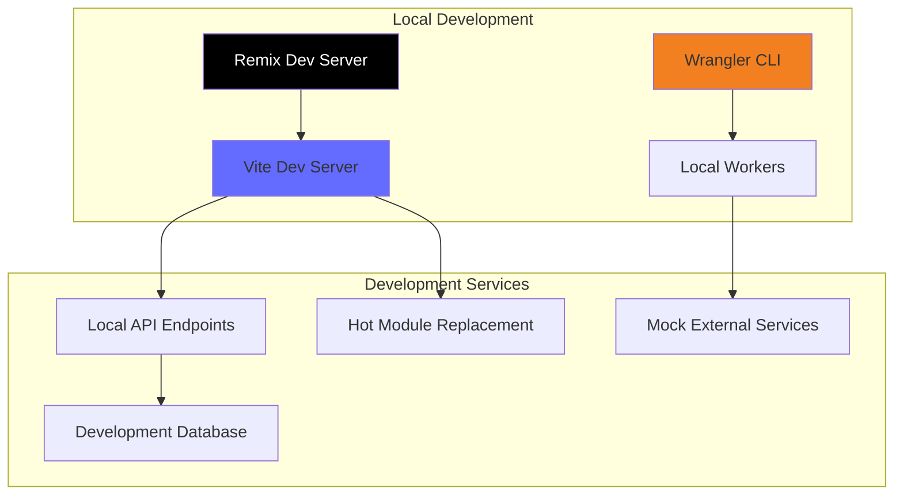

**Development Features:**
- Hot module replacement for instant feedback
- Local Workers simulation via Wrangler
- Mock external services for offline development
- Source map support for debugging

### Staging Environment

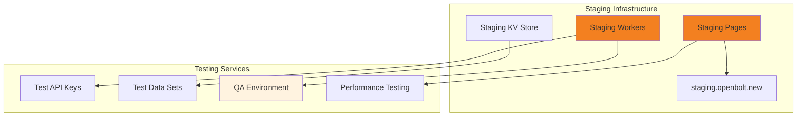

### Production Environment

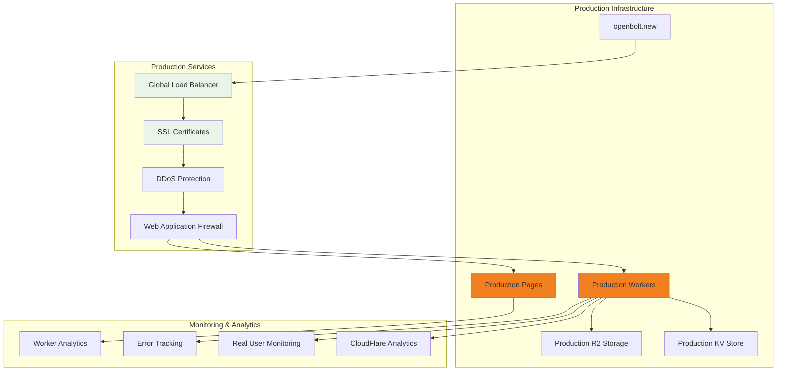

## CI/CD Pipeline

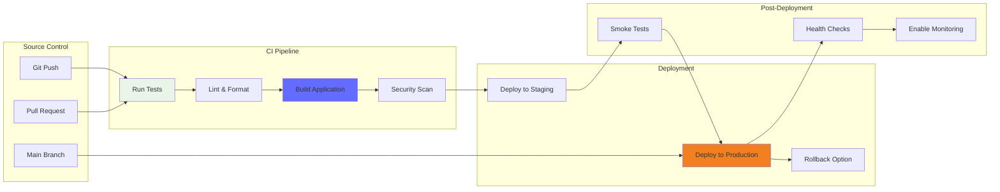

### Deployment Scripts

**Development:**
```bash
pnpm run dev          # Start local development server
pnpm run dev:workers  # Start local Workers development
```

**Building:**
```bash
pnpm run build        # Build for production
pnpm run typecheck    # TypeScript validation
pnpm run lint         # Code quality checks
```

**Deployment:**
```bash
pnpm run deploy:staging    # Deploy to staging
pnpm run deploy:production # Deploy to production
wrangler deploy           # Direct Worker deployment
```

## Performance Characteristics

### Global Performance

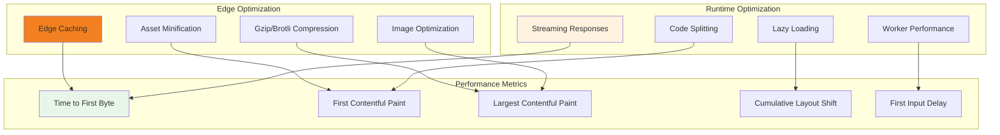

### Scaling Strategy

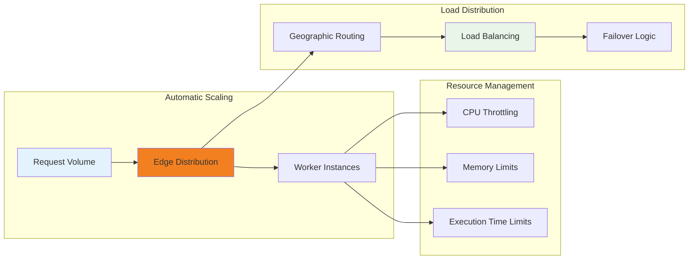

## Security Architecture

### Security Layers

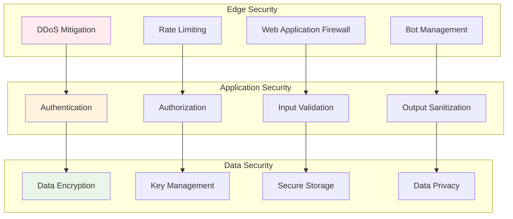

## Monitoring and Observability

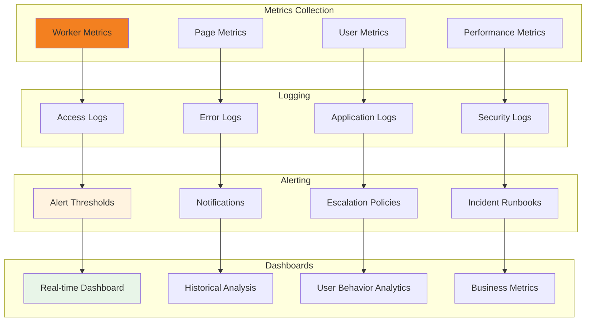

This deployment architecture provides:
- **Global performance** through edge computing
- **Automatic scaling** based on demand
- **High availability** with built-in redundancy
- **Security** at multiple layers
- **Observability** for proactive monitoring
- **Cost efficiency** through serverless pricing