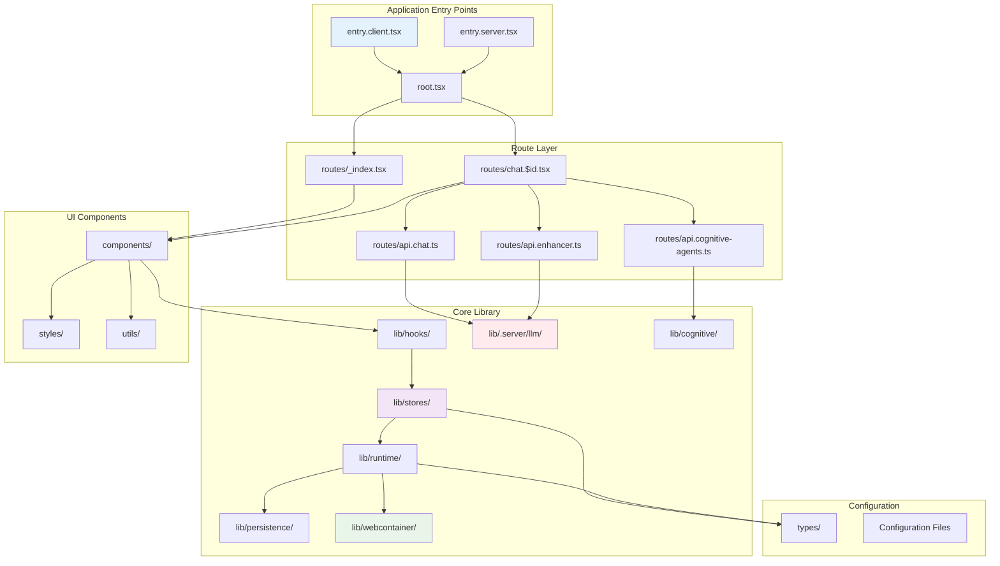
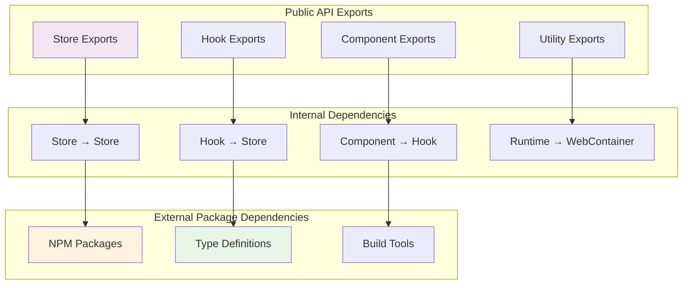
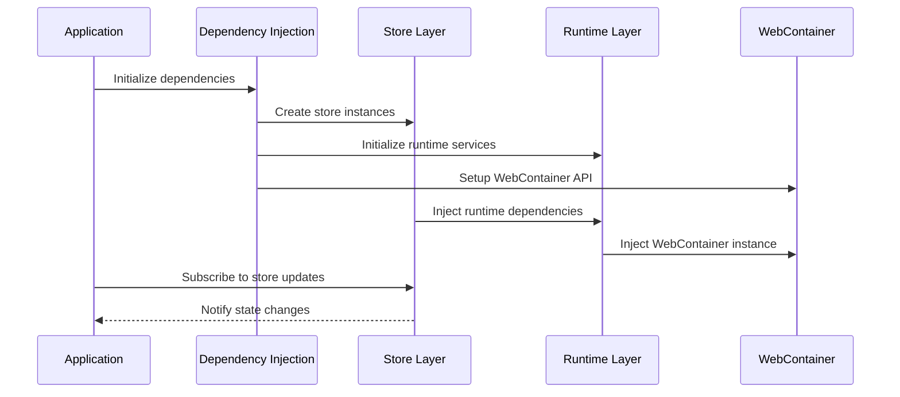
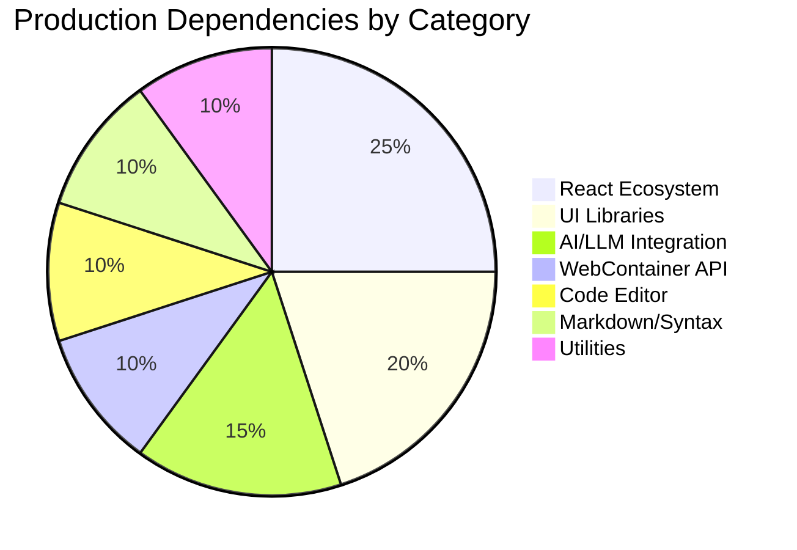
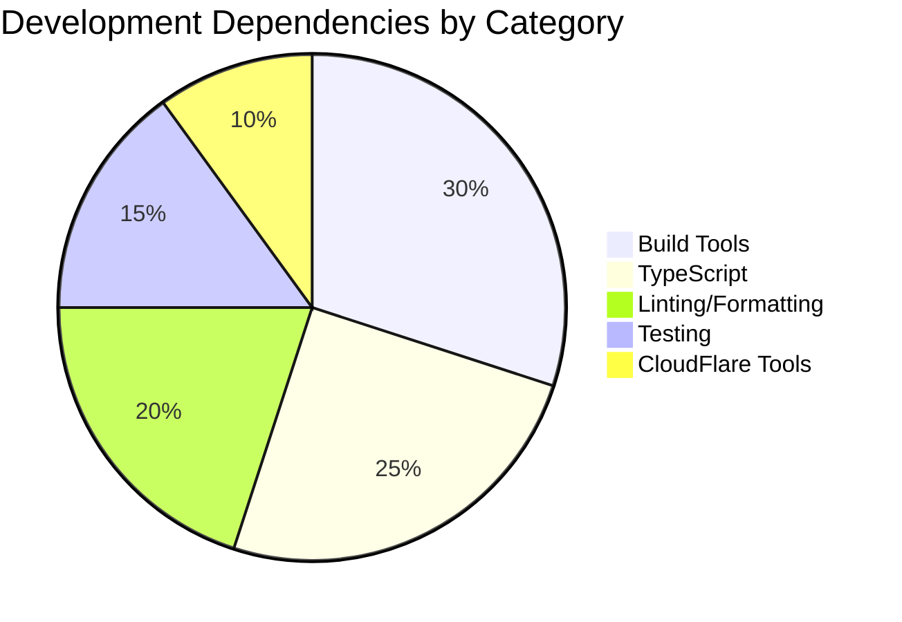
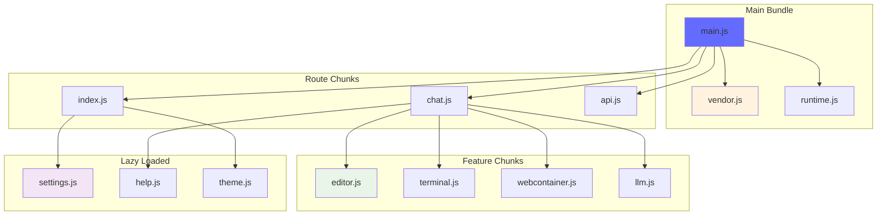
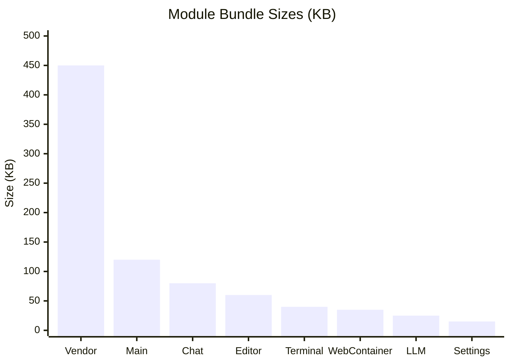
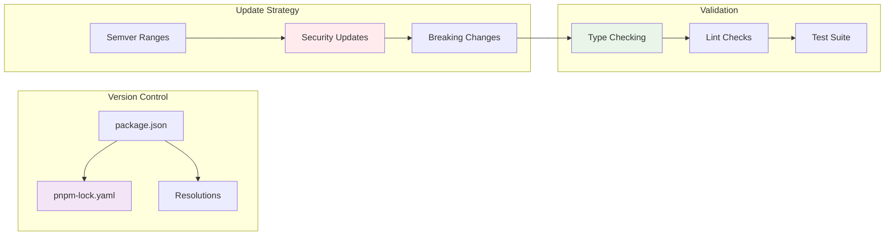
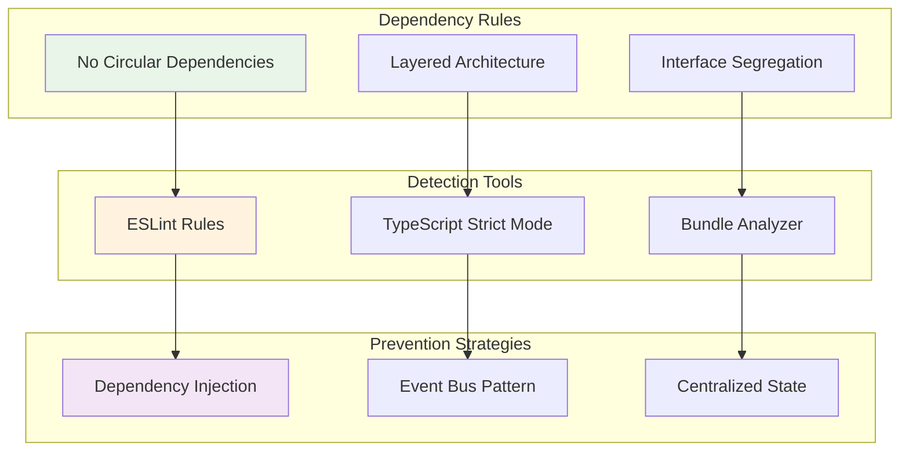

# Module Dependencies

This document provides a detailed view of the module structure and dependency relationships within the OpenBolt codebase.

## Module Hierarchy Overview



## Detailed Module Structure

### 1. Routes Module Dependencies

```mermaid
graph LR
    subgraph "Route Files"
        Index[_index.tsx]
        Chat[chat.$id.tsx]
        ChatAPIRoute[api.chat.ts]
        EnhancerAPIRoute[api.enhancer.ts]
        CognitiveAPIRoute[api.cognitive-agents.ts]
    end
    
    subgraph "Remix Framework"
        RemixReact[@remix-run/react]
        RemixCloudflare[@remix-run/cloudflare]
        LoaderFunction[Loader Functions]
        ActionFunction[Action Functions]
    end
    
    subgraph "External Dependencies"
        React[react]
        ReactDOM[react-dom]
        FramerMotion[framer-motion]
    end
    
    Index --> RemixReact
    Chat --> RemixReact
    ChatAPIRoute --> RemixCloudflare
    EnhancerAPIRoute --> RemixCloudflare
    CognitiveAPIRoute --> RemixCloudflare
    
    RemixReact --> React
    RemixCloudflare --> LoaderFunction
    RemixCloudflare --> ActionFunction
    
    Chat --> FramerMotion
    Index --> ReactDOM
    
    style Index fill:#000000,color:#ffffff
    style Chat fill:#000000,color:#ffffff
    style RemixReact fill:#000000,color:#ffffff
```

### 2. Stores Module Dependencies

```mermaid
graph TB
    subgraph "Store Files"
        WorkbenchStore[workbench.ts]
        FilesStore[files.ts]
        EditorStore[editor.ts]
        TerminalStore[terminal.ts]
        PreviewsStore[previews.ts]
        ThemeStore[theme.ts]
        CognitiveStore[cognitive-agents.ts]
    end
    
    subgraph "State Management"
        Nanostores[nanostores]
        NanostoresReact[@nanostores/react]
    end
    
    subgraph "Type Definitions"
        StoreTypes[Store Types]
        WebContainerTypes[WebContainer Types]
        ChatTypes[Chat Types]
    end
    
    subgraph "Utilities"
        DateFns[date-fns]
        Diff[diff]
        IstextorBinary[istextorbinary]
    end
    
    WorkbenchStore --> Nanostores
    FilesStore --> Nanostores
    EditorStore --> Nanostores
    TerminalStore --> Nanostores
    PreviewsStore --> Nanostores
    ThemeStore --> Nanostores
    CognitiveStore --> Nanostores
    
    Nanostores --> NanostoresReact
    
    WorkbenchStore --> StoreTypes
    FilesStore --> WebContainerTypes
    CognitiveStore --> ChatTypes
    
    WorkbenchStore --> DateFns
    FilesStore --> Diff
    FilesStore --> IstextorBinary
    
    style WorkbenchStore fill:#f3e5f5
    style Nanostores fill:#fff3e0
    style StoreTypes fill:#e8f5e8
```

### 3. Runtime Module Dependencies

```mermaid
graph TB
    subgraph "Runtime Files"
        MessageParser[message-parser.ts]
        ActionRunner[action-runner.ts]
        MessageParserSpec[message-parser.spec.ts]
    end
    
    subgraph "Processing Libraries"
        UnifiedJS[unified]
        UnistUtilVisit[unist-util-visit]
        RemarkGFM[remark-gfm]
        RehypeRaw[rehype-raw]
        RehypeSanitize[rehype-sanitize]
    end
    
    subgraph "WebContainer Integration"
        WebContainerAPI[@webcontainer/api]
        FileSystemAPI[File System API]
        ProcessAPI[Process API]
    end
    
    subgraph "Type System"
        RuntimeTypes[Runtime Types]
        ActionTypes[Action Types]
        ParserTypes[Parser Types]
    end
    
    MessageParser --> UnifiedJS
    MessageParser --> UnistUtilVisit
    MessageParser --> RemarkGFM
    MessageParser --> RehypeRaw
    MessageParser --> RehypeSanitize
    
    ActionRunner --> WebContainerAPI
    ActionRunner --> FileSystemAPI
    ActionRunner --> ProcessAPI
    
    MessageParser --> RuntimeTypes
    ActionRunner --> ActionTypes
    MessageParserSpec --> ParserTypes
    
    style MessageParser fill:#e8f5e8
    style ActionRunner fill:#e8f5e8
    style WebContainerAPI fill:#fff3e0
```

### 4. LLM Module Dependencies

```mermaid
graph TB
    subgraph "LLM Server Files"
        Model[model.ts]
        ApiKey[api-key.ts]
        StreamText[stream-text.ts]
        SwitchableStream[switchable-stream.ts]
        Prompts[prompts.ts]
        Constants[constants.ts]
    end
    
    subgraph "AI SDK"
        AISDKAnthropic[@ai-sdk/anthropic]
        AISDK[ai]
        AISDKCore[AI SDK Core]
    end
    
    subgraph "Streaming & HTTP"
        ReadableStream[ReadableStream API]
        Response[Response API]
        Headers[Headers API]
    end
    
    subgraph "Configuration"
        EnvVariables[Environment Variables]
        TypeDefinitions[Type Definitions]
        ErrorHandling[Error Handling]
    end
    
    Model --> AISDKAnthropic
    Model --> AISDK
    StreamText --> AISDKCore
    SwitchableStream --> ReadableStream
    
    StreamText --> Response
    StreamText --> Headers
    
    ApiKey --> EnvVariables
    Model --> TypeDefinitions
    StreamText --> ErrorHandling
    Constants --> EnvVariables
    
    style Model fill:#ffebee
    style StreamText fill:#ffebee
    style AISDKAnthropic fill:#fff3e0
```

### 5. UI Components Module Dependencies

```mermaid
graph LR
    subgraph "UI Components"
        ChatComponent[Chat Component]
        EditorComponent[Editor Component]
        TerminalComponent[Terminal Component]
        PreviewComponent[Preview Component]
        SettingsComponent[Settings Component]
    end
    
    subgraph "React Ecosystem"
        React[react]
        ReactDOM[react-dom]
        ReactHooks[React Hooks]
        ReactHotkeysHook[react-hotkeys-hook]
    end
    
    subgraph "UI Libraries"
        RadixUI[@radix-ui/*]
        FramerMotion[framer-motion]
        ReactToastify[react-toastify]
        ReactResizablePanels[react-resizable-panels]
    end
    
    subgraph "Code Editor"
        CodeMirror[@codemirror/*]
        CodeMirrorTheme[@uiw/codemirror-theme-vscode]
        LezerHighlight[@lezer/highlight]
    end
    
    subgraph "Markdown & Syntax"
        ReactMarkdown[react-markdown]
        Shiki[shiki]
        RehypePlugins[Rehype Plugins]
    end
    
    ChatComponent --> React
    EditorComponent --> React
    TerminalComponent --> React
    PreviewComponent --> React
    SettingsComponent --> React
    
    React --> ReactHooks
    ChatComponent --> ReactHotkeysHook
    
    SettingsComponent --> RadixUI
    ChatComponent --> FramerMotion
    ChatComponent --> ReactToastify
    EditorComponent --> ReactResizablePanels
    
    EditorComponent --> CodeMirror
    EditorComponent --> CodeMirrorTheme
    EditorComponent --> LezerHighlight
    
    ChatComponent --> ReactMarkdown
    EditorComponent --> Shiki
    ReactMarkdown --> RehypePlugins
    
    style ChatComponent fill:#e3f2fd
    style CodeMirror fill:#fff3e0
    style ReactMarkdown fill:#e8f5e8
```

### 6. WebContainer Module Dependencies

```mermaid
graph TB
    subgraph "WebContainer Integration"
        WebContainerStore[WebContainer Store]
        FileSystemManager[File System Manager]
        TerminalManager[Terminal Manager]
        ProcessManager[Process Manager]
    end
    
    subgraph "WebContainer API"
        WebContainerAPI[@webcontainer/api]
        FileSystemAPI[FileSystem API]
        ProcessAPI[Process API]
        TerminalAPI[Terminal API]
    end
    
    subgraph "Terminal UI"
        XTerm[@xterm/xterm]
        XTermAddonFit[@xterm/addon-fit]
        XTermAddonWebLinks[@xterm/addon-web-links]
    end
    
    subgraph "File Operations"
        NodePath[node:path]
        NodeBuffer[node:buffer]
        TextEncoder[TextEncoder/TextDecoder]
    end
    
    WebContainerStore --> WebContainerAPI
    FileSystemManager --> FileSystemAPI
    TerminalManager --> TerminalAPI
    ProcessManager --> ProcessAPI
    
    TerminalManager --> XTerm
    TerminalManager --> XTermAddonFit
    TerminalManager --> XTermAddonWebLinks
    
    FileSystemManager --> NodePath
    FileSystemManager --> NodeBuffer
    FileSystemManager --> TextEncoder
    
    style WebContainerStore fill:#e8f5e8
    style WebContainerAPI fill:#fff3e0
    style XTerm fill:#f3e5f5
```

## Cross-Module Dependencies

### Import/Export Relationships



### Dependency Injection Patterns



## Package.json Dependencies Analysis

### Production Dependencies



### Development Dependencies



## Bundle Analysis

### Code Splitting Strategy



### Module Size Analysis



## Dependency Management Best Practices

### Version Management



### Circular Dependency Prevention



This module dependency architecture ensures:
- **Clear separation of concerns** across modules
- **Minimal coupling** between components
- **Efficient bundle splitting** for optimal loading
- **Type safety** throughout the dependency chain
- **Maintainable structure** for long-term development